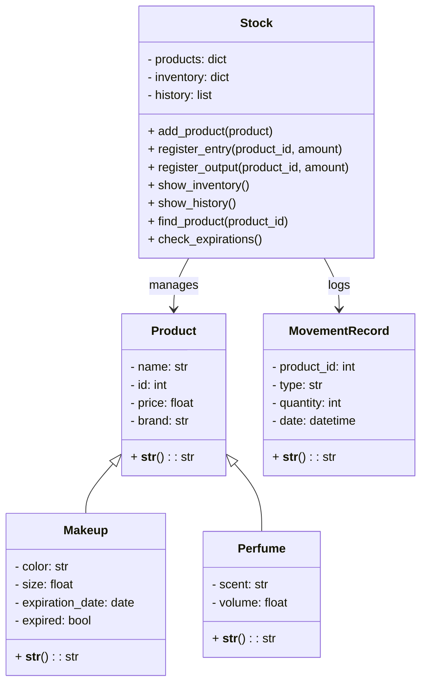

# Makeup Inventory Project

Sistema de gestión de inventario para productos de maquillaje desarrollado en Python, utilizando programación orientada a objetos (POO) y manejo de archivos. La aplicación funciona a través de consola y permite realizar operaciones básicas de una bodega.

---
## Tecnologías utilizadas

- Python 
- Manejo de clases y objetos
- Archivos JSON para almacenamiento
- Consola interactiva

---

## Funcionalidades principales

Este sistema incluye las siguientes opciones de menú:

1. **Mostrar inventario**  
   Lista todos los productos actualmente almacenados.

2. **Registrar entrada de stock**  
   Permite ingresar nuevas unidades de un producto existente o nuevo.

3. **Registrar salida de stock**  
   Registra la salida de unidades de un producto (por venta, uso, etc).

4. **Buscar producto por ID**  
   Permite buscar información de un producto mediante su identificador.

5. **Mostrar historial de movimientos**  
   Muestra las entradas y salidas registradas por producto.

6. **Revisar productos vencidos**  
   Revisa y lista los productos cuya fecha de expiración ha pasado.

7. **Guardar inventario en JSON**  
   Guarda el estado actual del inventario en un archivo `.json`.

8. **Agregar producto manualmente**  
   Añade un nuevo producto ingresando sus datos manualmente.

9. **Eliminar producto por ID**  
   Elimina un producto específico del inventario.

0. **Salir**  
   Finaliza el programa.

# Diagrama de Clases

# Diagrama de Clases

